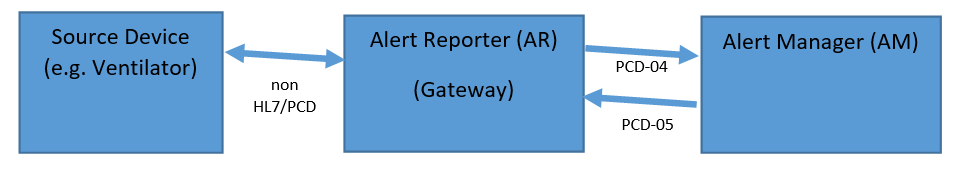

# Communication from AR to AM for Silent-Hospital Use-Case

Assuming Silent-Hospital wants to build a Distributed Alarm System (DAS) according to 60601-1-8 we need to raise an alarm at both endpoints in case of communication failures.
In order to achieve this we need to check the connection between AM and AR periodically (in order to raise an alarm at the source device and at the communicator).
Also each alarm reported via PCD-04 message needs a timely response with a technical confirmation in order to keep the source device to not raise a technical condition indicating an alarm system failure.
The PCD-04 and PCD-05 messages are transported on different TCP sockets. The AR is opening a listening socket for PCD-04 message and the AM is opening a socket for PCD-05 messages. The port shall be.
Requirements for Watchdog (aka Keep-Alive) Message
The current model is to send a PCD-04 message as a watchdog message (see Reference message 1). 
The AR expects this to be answered from the AM with an ACK message with MSA-1 segment containing the acknowledge code “CA” (see Reference message 2). 
It is expected that the ACK message is received on the same socket as the PCD-04 was sent.
The timeout for the ACK is specified by the AR in an OBX segment. The code (OBX-3) shall be 67860^MDC_ATTR_CONFIRM_TIMEOUT^MDC, the timeout is specified in OBX-5 with the unit in OBX-6
The default timeout for the ACK for the watchdog PCD-04 message is 5 seconds.
The watchdog message shall use the following code: MDC_EVT_WATCHDOG (CF-Code: TBD, for now: 0)
The watchdog message shall use an alarm state active and an inactivation state enabled while the device is connected to the AR. 
The watchdog message shall use the same location identifier and equipment ID as an alarm sourced from the device.
The watchdog message shall use the priority PN and the alert type SP
The watchdog message may provide the real patient information.
Once an AM receives a Watchdog message from AR it needs to check periodically for further watchdog messages and react accordingly if it does not come in. This could e.g. be a message to AC in order to alarm the user.
The AR shall send one last watchdog message with alarm state Inactive to indicate an intended shutdown of this alarm source. 

Reference Messages:
1: Watchdog PCD-04
MSH|^~\&|0030E60000000001^EUI-64|Draeger|||20191105183941+0100||ORU^R40^ORU_R40|79|D|2.6|||AL|NE||||IHE_PCD_ACM_001^IHE PCD^1.3.6.1.4.1.19376.1.6.4.4^ISO
PID|||8888^^^^AN||Data^Simulated^Patient^^^^L
PV1|||TAM^^^SC8^^tkl
OBR|1||0^urn:uuid:df041f5c-a3c9-11e9-8d8a-0050b612afeb^0030E60000000001^EUI-64|196616^MDC_EVT_ALARM^MDC|||20191105183941+0100
OBX|1|ST|258047^MDC_EVT_ACTIVE^MDC|1.0.0.0.1|Heartbeat-useless||||||F|||||||urn:uuid:df041f5c-a3c9-11e9-8d8a-0050b612afeb^^urn:uuid:df041f5c-a3c9-11e9-8d8a-0050b612afeb^URN
OBX|2|ST|68480^MDC_ATTR_ALERT_SOURCE^MDC|1.0.0.0.2|69837^MDC_TODO^MDC||||||F|||||||urn:uuid:df041f5c-a3c9-11e9-8d8a-0050b612afeb^^urn:uuid:df041f5c-a3c9-11e9-8d8a-0050b612afeb^URN
OBX|3|ST|68165^MDC_ATTR_EVENT_PHASE^MDC|1.0.0.0.3|start||||||F|||||||urn:uuid:df041f5c-a3c9-11e9-8d8a-0050b612afeb^^urn:uuid:df041f5c-a3c9-11e9-8d8a-0050b612afeb^URN
OBX|4|ST|68166^MDC_ATTR_ALARM_STATE^MDC|1.0.0.0.4|active||||||F|||||||urn:uuid:df041f5c-a3c9-11e9-8d8a-0050b612afeb^^urn:uuid:df041f5c-a3c9-11e9-8d8a-0050b612afeb^URN
OBX|5|ST|68167^MDC_ATTR_ALARM_INACTIVATION_STATE^MDC|1.0.0.0.5|enabled||||||F|||||||urn:uuid:df041f5c-a3c9-11e9-8d8a-0050b612afeb^^urn:uuid:df041f5c-a3c9-11e9-8d8a-0050b612afeb^URN
OBX|6|ST|68168^MDC_ATTR_ALARM_PRIORITY^MDC|1.0.0.0.6|PN||||||F|||||||urn:uuid:df041f5c-a3c9-11e9-8d8a-0050b612afeb^^urn:uuid:df041f5c-a3c9-11e9-8d8a-0050b612afeb^URN
OBX|7|ST|68485^MDC_ATTR_ALERT_TYPE^MDC|1.0.0.0.7|SA||||||F|||||||urn:uuid:df041f5c-a3c9-11e9-8d8a-0050b612afeb^^urn:uuid:df041f5c-a3c9-11e9-8d8a-0050b612afeb^URN
2: Answer to Watchdog via ACK
MSH|^~\&#|||||20191105183942||ACK^R40|||2.7
MSA|AA|79
3: Alarm message PCD04 AR->AM
MSH|^~\&|0030E60000000001^EUI-64|Draeger|||20191105183941+0100||ORU^R40^ORU_R40|79|D|2.6|||AL|NE||||IHE_PCD_ACM_001^IHE PCD^1.3.6.1.4.1.19376.1.6.4.4^ISO
PID|||8888^^^^AN||Data^Simulated^Patient^^^^L
PV1|||TAM^^^SC8^^tkl
OBR|1||1^381a5f0b-b319-4db3-b100-4b5efa76147e^0030E60000000001|196616^MDC_EVT_ALARM^MDC|||20191105183941+0100
OBX|1|ST|196650|1.0.0.0.1|PVC/min > #||||||F|||||||urn:uuid:df041f5c-a3c9-11e9-8d8a-0050b612afeb^^urn:uuid:df041f5c-a3c9-11e9-8d8a-0050b612afeb^URN
OBX|2|NM|68480^MDC_ATTR_ALERT_SOURCE^MDC|1.0.0.0.2|val|unit|||||F|||time||||urn:uuid:df041f5c-a3c9-11e9-8d8a-0050b612afeb^^urn:uuid:df041f5c-a3c9-11e9-8d8a-0050b612afeb^URN
OBX|3|ST|68165^MDC_ATTR_EVENT_PHASE^MDC|1.0.0.0.3|phase||||||F|||||||urn:uuid:df041f5c-a3c9-11e9-8d8a-0050b612afeb^^urn:uuid:df041f5c-a3c9-11e9-8d8a-0050b612afeb^URN
OBX|4|ST|68166^MDC_ATTR_ALARM_STATE^MDC|1.0.0.0.4|state||||||F|||||||urn:uuid:df041f5c-a3c9-11e9-8d8a-0050b612afeb^^urn:uuid:df041f5c-a3c9-11e9-8d8a-0050b612afeb^URN
OBX|5|ST|68167^MDC_ATTR_ALARM_INACTIVATION_STATE^MDC|1.0.0.0.5|inAcState||||||F|||||||urn:uuid:df041f5c-a3c9-11e9-8d8a-0050b612afeb^^urn:uuid:df041f5c-a3c9-11e9-8d8a-0050b612afeb^URN
OBX|6|ST|68168^MDC_ATTR_ALARM_PRIORITY^MDC|1.0.0.0.6|prio||||||F|||||||urn:uuid:df041f5c-a3c9-11e9-8d8a-0050b612afeb^^urn:uuid:df041f5c-a3c9-11e9-8d8a-0050b612afeb^URN
OBX|7|ST|68485^MDC_ATTR_ALERT_TYPE^MDC|1.0.0.0.7|kind||||||F|||||||urn:uuid:df041f5c-a3c9-11e9-8d8a-0050b612afeb^^urn:uuid:df041f5c-a3c9-11e9-8d8a-0050b612afeb^URN
4: Alarm ‘acknowledge’ PCD05 AM->AR
MSH|^~\&#||MockAM|||20191105183942||ORA^R41^ORA_R41|79||2.7
OBR|||1^381a5f0b-b319-4db3-b100-4b5efa76147e
PRT|||Delivered
